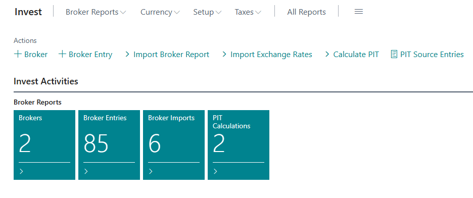
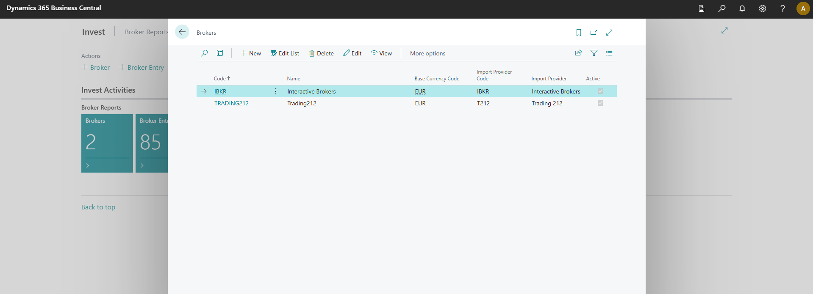
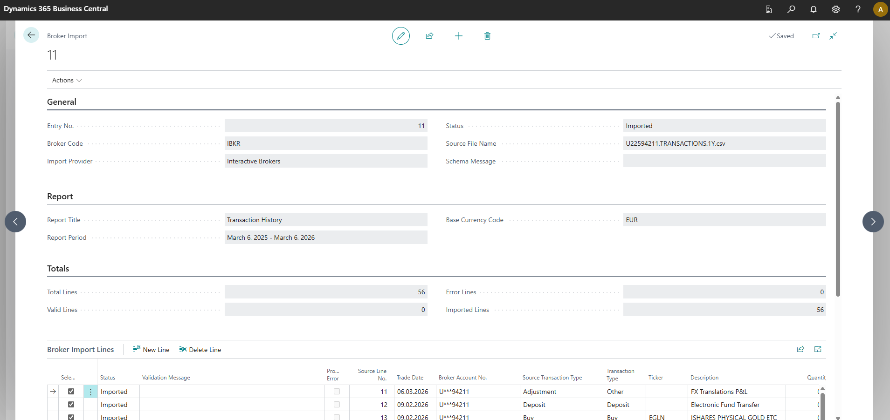
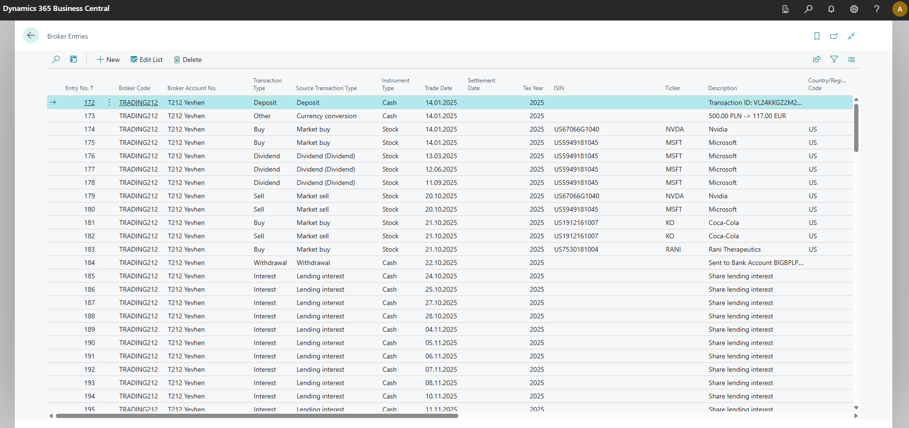
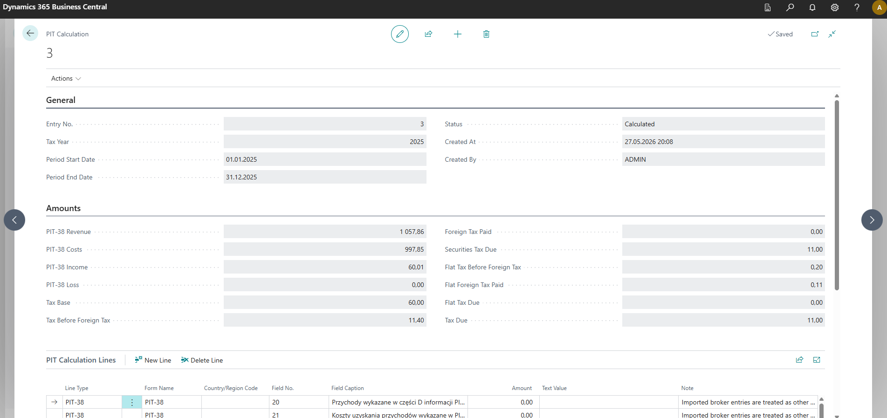

# Invest for Business Central

Invest is an AL extension for Microsoft Dynamics 365 Business Central that helps private investors import broker statements, review investment entries, maintain exchange rates, and prepare source data for Polish PIT-38 and PIT/ZG calculations.

The app is designed as a self-contained public project. It does not depend on a separate FX Rate extension.

## Features

- Broker statement import with preview and validation.
- Supported broker import providers: Interactive Brokers and Trading 212.
- Permanent broker entry ledger for buys, sells, dividends, interest, fees, taxes, deposits, withdrawals, and other transactions.
- Built-in exchange rate import from ECB, NBU, and NBP.
- Exchange rate source selection on the standard Business Central currency card/list.
- Use of standard Business Central `Currency` and `Currency Exchange Rate` tables.
- Instrument tax country mapping for tickers and ISINs.
- PIT-38 and PIT/ZG calculation history.
- Excel and ZIP export for PIT calculation results.
- `Investment Manager` role center for the main workflow.

## Brokers

Create brokers for the accounts you want to import. Each broker defines the import provider, base currency, account identifier, and whether the broker is active for new imports.

## Exchange Rates

Invest stores imported rates in the standard `Currency Exchange Rate` table. For each currency, select an `Exchange Rate Source`:

| Source | Description |
|---|---|
| ECB | European Central Bank |
| NBU | National Bank of Ukraine |
| NBP | National Bank of Poland |

Then run `Import Exchange Rates` for the required period. HTTP client requests must be enabled for the extension before online exchange rate import can run.

## Broker Imports

Broker reports are first loaded into a preview document. The import keeps the original source context, validates rows, shows errors, and lets you import only valid lines into permanent broker entries.

## Broker Entries

After import, transactions are stored as broker entries. These entries are the working ledger for investment transactions and the source for PIT calculations.

## PIT Calculation

Run `Calculate PIT` to create a PIT calculation for a selected tax year and period. The result stores PIT-38 values, PIT/ZG lines when foreign income exists, warnings, and export actions.

## Typical Workflow

1. Create or verify currencies and countries/regions.
2. Select exchange rate sources on currencies.
3. Import exchange rates for the required period.
4. Create brokers and choose the import provider.
5. Import broker reports into preview.
6. Review validation errors and duplicate checks.
7. Import valid lines into broker entries.
8. Complete missing instrument countries or ISINs when needed.
9. Run PIT calculation.
10. Export and review the PIT ZIP archive.

## Requirements

- Microsoft Dynamics 365 Business Central application 28.0.
- AL runtime 17.0.
- Object range: `50100..50149`.

## Disclaimer

Invest helps prepare and review investment tax calculation data. It does not file tax returns and does not replace professional tax advice. Always review generated results before using them in an official declaration.